Fronting an entire city block this sophisticated loft-inspired building reflects the site's industrial past. The facade is composed of a blonde weathered brick across its first four stories, accentuated by vertical and horizontal metal panel banding, capped off by a metal panel fifth story to indicate the modern amenities that this building brings to its residents. Each of the 54 units boasts floor to ceiling glazing throughout most of its public areas to bring in ample light deep into the floor plate. The building features a cellar level fitness center, on-site laundry, a co-working space open for all tenants, as well as a 1200 SF lounge with access to the generous terrace space featured on the 5th floor setback. Not only that, but the building features an ample roof top area with greenery, lounge seating, outdoor kitchen, and a dog run area all accessible via one of the buildings two elevators.

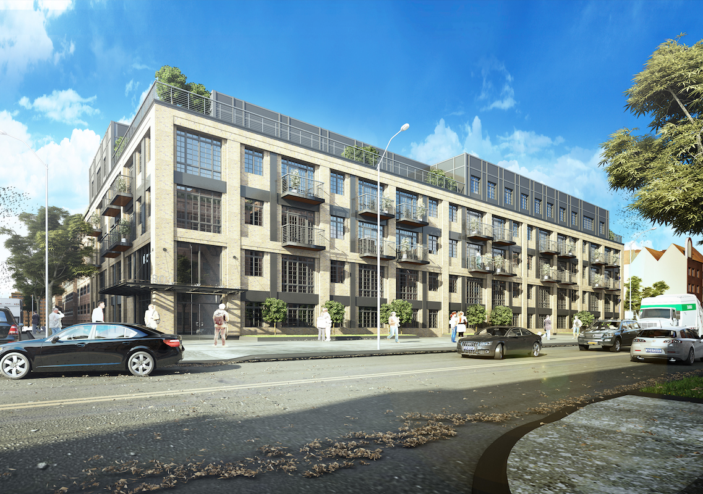
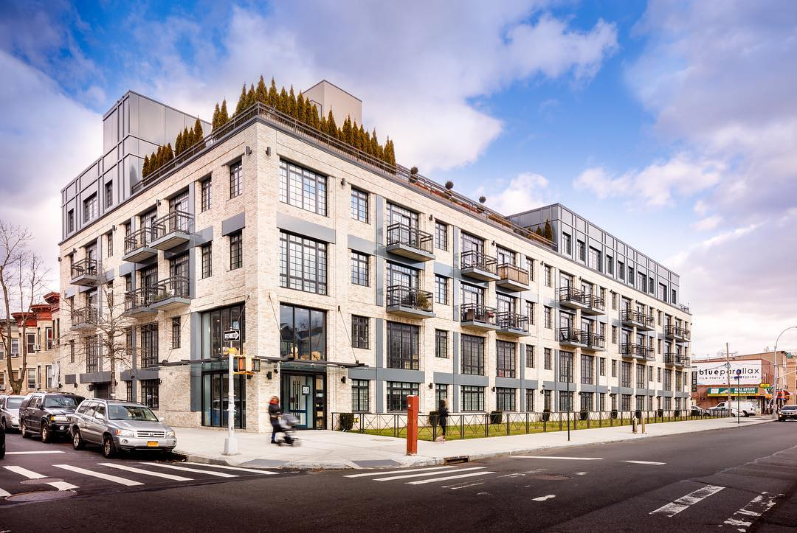
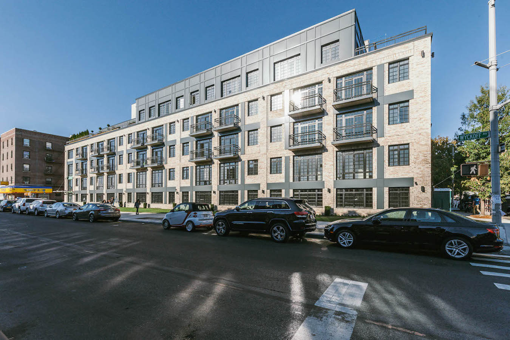
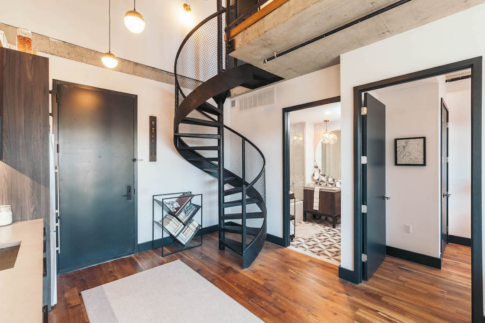
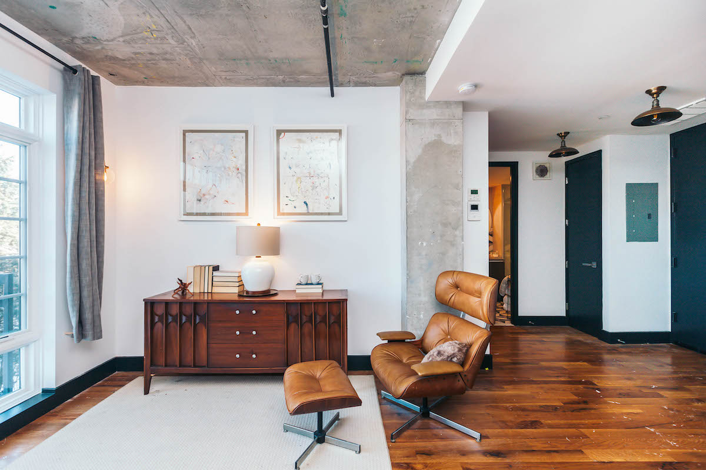
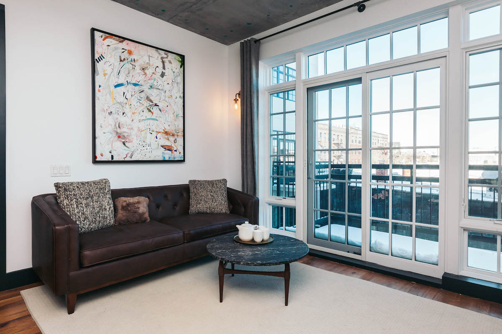
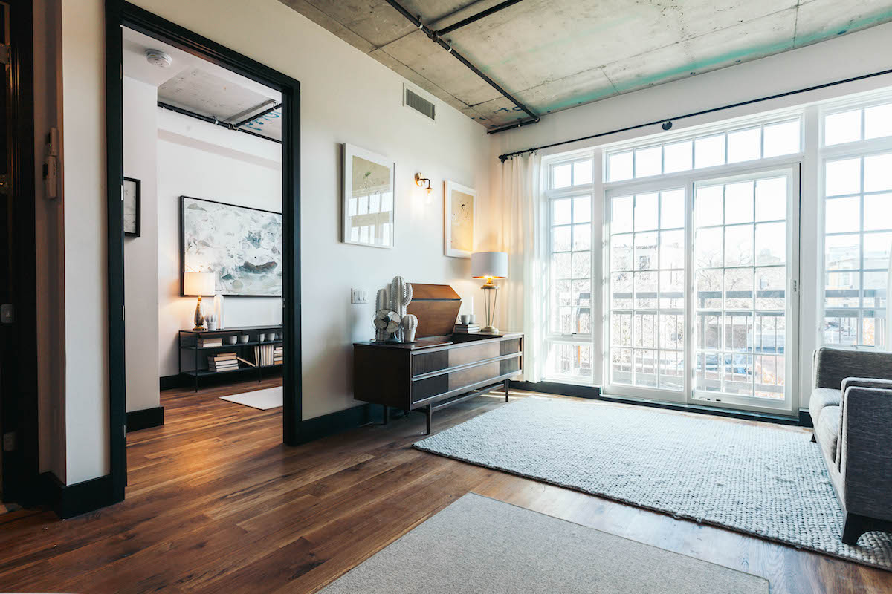
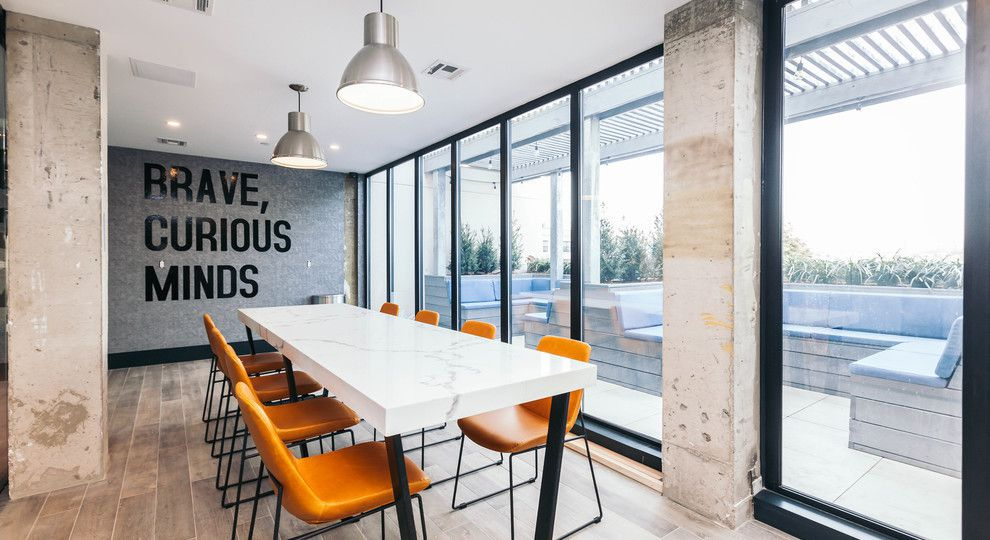

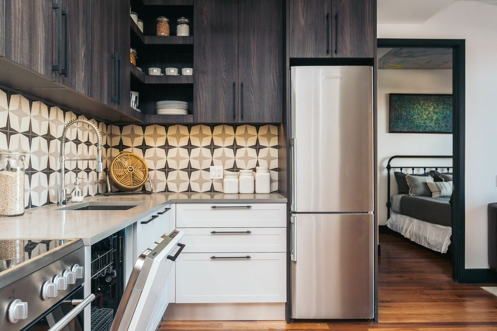
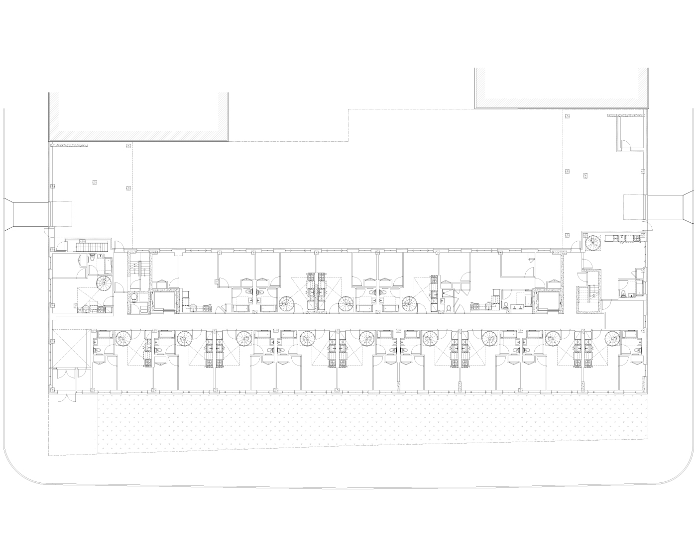
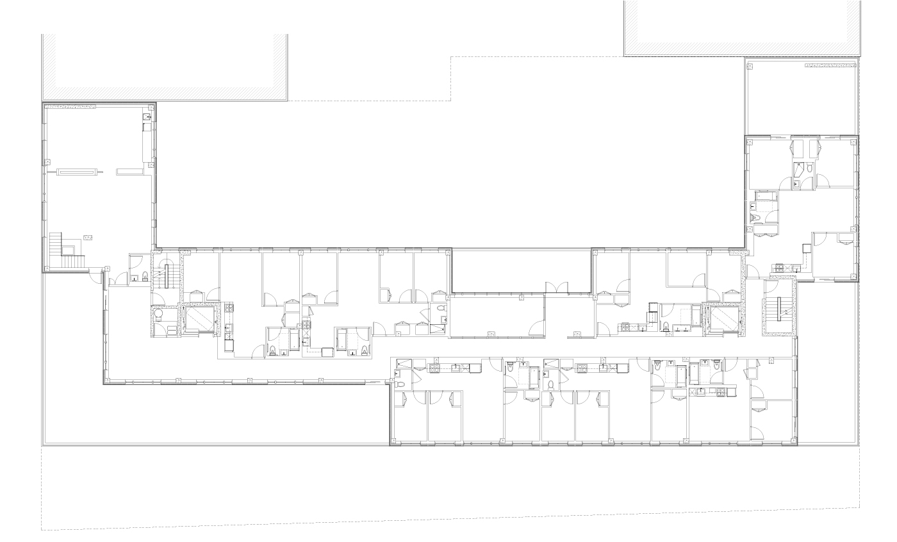
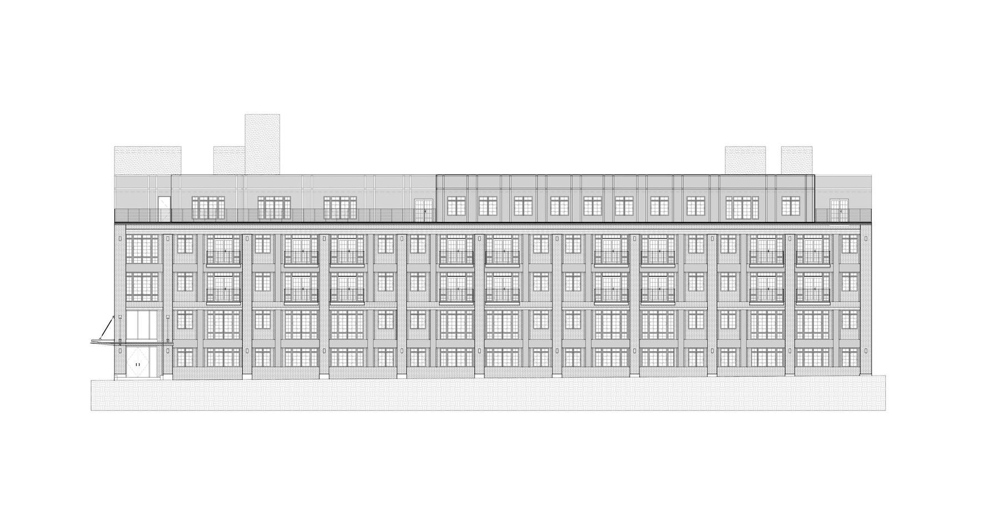
